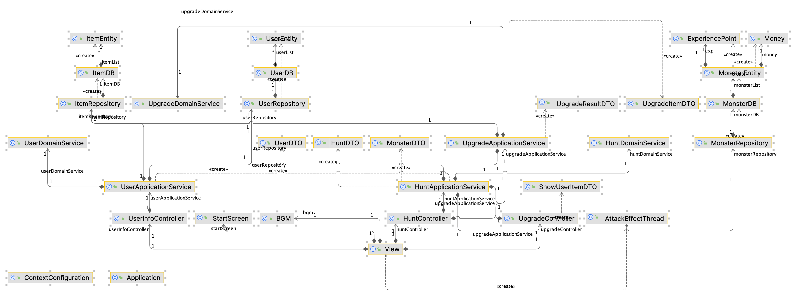

# README.md

팀명: World Of Metacraft

| 박소연 | 안희찬 | 연정흠 | 이정민 | 조평훈 | 정지원 |
| --- | --- | --- | --- | --- | --- |

# 프로젝트 개요

---

## 프로젝트 목표

### 1. 이전 프로젝트 구조 개선

이전 프로젝트 구조


이전 프로젝트 패키지 구조



### 2. Spring Boot MVC 구조 최대한 지향


## 초기 아이디어

카드 기반 턴제 RPG 게임

](README/Untitled%202.png)

출처 : [https://yandex.com/games/app/221014?utm_campaign=en-kor_games_general_all_google_search|19896521226&utm_medium=search&utm_source=google&utm_term=game+on+the+internet&utm_content=k50id|kwd-357970823244|cid|19896521226|aid|652794716528|gid|154366878184|pos||src|g_|dvc|c|reg|1009875|rin||#app-id=221014&catalog-session-uid=catalog-9bf8043e-f935-58ee-9e3d-3823920c4f03-1687247620240-7dfd&rtx-reqid=11083082354897718565&pos={"listType":"suggested","tabCategory":"role"}](https://yandex.com/games/app/221014?utm_campaign=en-kor_games_general_all_google_search%7C19896521226&utm_medium=search&utm_source=google&utm_term=game+on+the+internet&utm_content=k50id%7Ckwd-357970823244%7Ccid%7C19896521226%7Caid%7C652794716528%7Cgid%7C154366878184%7Cpos%7C%7Csrc%7Cg_%7Cdvc%7Cc%7Creg%7C1009875%7Crin%7C%7C#app-id=221014&catalog-session-uid=catalog-9bf8043e-f935-58ee-9e3d-3823920c4f03-1687247620240-7dfd&rtx-reqid=11083082354897718565&pos=%7B%22listType%22:%22suggested%22,%22tabCategory%22:%22role%22%7D)


- 기존의 유저 엔티티와 아이템 엔티티를 하나의 엔티티로 처리
- 유저가 카드 형태
  1. 유저 자체가 강화됨
- 속성 필드 추가 (물, 불, 풀)
  1. 카드마다 속성이 고정 → 사용자는 카드를 사냥을 들어갈 때마다 교체
  2. 강화 : 유저 속성 강화
  3. 아이템은 고정값을 가지고 강화된 유저의 속성과 비례해서 공격력 계산

## 주요 기능

- 로그인
  - 비밀번호 검증, 로그인 예외처리, 로그인 권한에 따른 접근 제어, SESSION을 통한 유저의 정보 전달, 로그아웃 처리
- 사냥
  - 몬스터 랜덤 자동 등장, 맵 선택 기능, 유저의 속성 편집 기능, 속성 별 달라지는 공격력, REWARD - EXP, MONEY
- 강화
  - 확률에 따른 UPGRADE 성패여부, 강화가 진행됨에 따라 변경되는 유저의 강화 레벨, 보유금을 통한 강화 가능 여부
- 사용자 정보
  - 강화레벨, 레벨에 따른 체력, 공격력 변화, 경험치에 따른 레벨업 여부 및 남은 경험치 계산, 속성 변경

## 관련 리소스

### 월드 오브 워크래프트 폰트

[https://fontmeme.com/fonts/folkard-font/](https://fontmeme.com/fonts/folkard-font/)


### 하스스톤 커스텀 카드 생성

[http://www.hearthcards.net/index_moo2.php](http://www.hearthcards.net/index_moo2.php)


# Process


## **기능별 구조**

### Hunt

- 전투 초기화 및 전투 결과 (승리, 실패) / 전투 로그 반환 메소드 등 구현
  - 버튼 클릭 한번으로 유저→ 몬스터 → 유저 → . . . 공격 진행
  - 속성 공격 (속성 우세/동등/열세)
  - 특수 스킬 (더블 어택 / 힐 (로그는 공격만 반영됨))
- 다양한 DTO들을 활용해 전투 결과 저장 및 반환
- 전투 초기화 및 전투 결과 (승리, 실패) / 전투 로그 반환 메소드 등 구현
  - 버튼 클릭 한번으로 유저→ 몬스터 → 유저 → . . . 공격 진행
  - 속성 공격 (속성 우세/동등/열세)
  - 특수 스킬 (더블 어택 / 힐 (로그는 공격만 반영됨))
- 다양한 DTO들을 활용해 전투 결과 저장 및 반환

### User

- 로그인
  1. 이름, 비밀번호 DTO 전송
  2. 사용자가 입력한 이름을 바탕으로 데이터베이스 조회, 사용자가 없을 경우 `UserExistException` 발생
  3. 사용자의 비밀번호는 VO를 통해 관리
  4. 사용자가 입력한 비밀번호 String을 통해 새로운 비밀번호 VO 객체를 생성하여 getValue를 통해 암호화 값을 리턴받아 사용자가 입력한 값의 비밀번호 VO 객체 값과 데이터베이스에 저장된 비밀번호 VO 객체 값을 비교하여 같으면 pass, 다를 경우 `PasswordUnCorrectException` 발생
  5. 어떠한 `Exception` 도 발생하지 않으면 로그인 처리
- 강화 레벨, 레벨에 따른 체력 / 공격력 변화
  1. 사용자*기본 공격력 = 사용자의 기본 공격력 + 사용자 레벨 * 공격 상수 값
     총 공격력 : 기본 공격력 * 강화 레벨 의 제곱
     (만약 강화 레벨 이 0일 경우, 기본 공격력이 총 공격력)*
  2. 사용자*기본 체력 = 사용자의 기본 체력 + 사용자 레벨 * 체력 상수 값
     총 체력 : 기본 체력 * 강화 레벨 의 제곱
     (만약 강화 레벨 이 0일 경우, 기본 체력이 총 체력)*

### 강화

- 강화 로직 요구사항
  1. 아이템 강화 레벨에 높아질수록 강화 성공 확률이 낮아져야 한다.
  2. 강화가 실패할 경우 아이템의 강화 레벨이 기존의 강화 레벨의-1이 되어야 한다.
  3. 강화 성공 확률이 상식적인 변동 이어야 한다.
  4. 강화 성공 확률이 추적 가능해야 한다. (같은 파라미터를 입력하면 같은 성공 확률이 나와야 한다.)
  5. 최대 강화 레벨은 정해져 있다. (팀원들과 상의 후 언제든지 바뀔 수 있다.)
- 강화 가능 여부 체크
- 강화 결과(성공, 실패)에 따른 예상 스텟 변화 결과 계산

  > 강화 로직
  random.nextGaussian() : 평균 0.0 표준편차 1.0의 Gauss(가우스) 분포의 double 형 난수 생성nextGaussian() 에 수를 곱할 경우 표준편차가 바뀌고 수를 더할 경우 평균이 바뀜.

  평균 0.0 표준편차 1.0일 경우, P(-1 <= X <= 1) = 0.6827 (-3.9 <= X <= 4.7 근사치)

  updateStochasticSeed 는 upgradeLevel(1,2,3,4 ...)과 임의의 민감도를 곱하여 계산

  updateStochasticSeed 와 가우시안분포 값을 곱할 경우 (표준편차를 높임) upgradeLevel 가 높아질수록 정규 분포 상에서 확률 밀도 함수 값이 작아져 updateStochastic 의 값이 -1~1 사이일 확률이 점점 낮아짐.

  updateStochasticSeed에서 upgradeLevel에 큰 숫자를 곱할 경우 민감도가 커짐 위 밀도 함수의 값 증가폭이 더 가속됨.

  참고자료 : [https://www.geogebra.org/m/Mmf3AX7y](https://www.geogebra.org/m/Mmf3AX7y)
  >
- 강화 수행
  평균0, 표준편차 1 일 때의 -1~1 사이일 확률 : 약 68%

  

  평균0, 표준편차 2 일 때의 -1~1 사이일 확률 : 약 38%

  

- 강화 결과 저장

## Layer **Architecture**


## Package **Structure**

```bash
.
└── webrpg
    ├── common
    │   ├── interceptor
    │   │   └── LoginInterceptor.java
    │   └── utils
    ├── configuration
    │   ├── Application.java
    │   ├── ContextConfiguration.java
    │   ├── ErrorConfiguration.java
    │   └── WebConfiguration.java
    ├── database
    │   ├── Map.java
    │   ├── MapDB.java
    │   ├── MonsterDB.java
    │   └── UserInMemoryDatabase.java
    ├── hunt
    │   ├── application
    │   │   ├── controller
    │   │   │   ├── ChoiceMapController.java
    │   │   │   ├── HuntIntegratedController.java
    │   │   │   ├── MonsterAppearController.java
    │   │   │   ├── MonsterAttackController.java
    │   │   │   └── UserAttackController.java
    │   │   ├── dto
    │   │   │   ├── ElementDamageDTO.java
    │   │   │   ├── GetElementalDTO.java
    │   │   │   ├── HuntProcessDTO.java
    │   │   │   ├── IntegrateMonsterAttackDTO.java
    │   │   │   ├── IntegrateUserAttackDTO.java
    │   │   │   ├── MonsterAttackDTO.java
    │   │   │   ├── MonsterDTO.java
    │   │   │   ├── MonsterInfoDTO.java
    │   │   │   ├── MonsterPatternDTO.java
    │   │   │   ├── MonsterStrDTO.java
    │   │   │   ├── MonsterUseDTO.java
    │   │   │   ├── NoEtDmgDTO.java
    │   │   │   ├── RandomMonsterDTO.java
    │   │   │   ├── UserAttackDTO.java
    │   │   │   ├── UserGetElementalDTO.java
    │   │   │   └── UserPatternDTO.java
    │   │   └── service
    │   │       ├── ChoiceMapApplicationService.java
    │   │       ├── HuntElementalDamage.java
    │   │       ├── MonsterAppearApplicationService.java
    │   │       ├── MonsterApplicationService.java
    │   │       ├── MonsterAttackApplicationService.java
    │   │       └── UserAttackApplicationService.java
    │   ├── domain
    │   │   ├── aggregate
    │   │   │   ├── entity
    │   │   │   │   ├── HuntMap.java
    │   │   │   │   └── Monster.java
    │   │   │   ├── enumtype
    │   │   │   │   └── MonsterET.java
    │   │   │   └── vo
    │   │   │       ├── MonsterHp.java
    │   │   │       ├── MonsterPower.java
    │   │   │       ├── RewardExp.java
    │   │   │       └── RewardMoney.java
    │   │   ├── exception
    │   │   │   └── Exception.java
    │   │   ├── repository
    │   │   │   ├── DomainMapRepository.java
    │   │   │   └── DomainRepository.java
    │   │   └── service
    │   │       ├── AbilityCalc.java
    │   │       ├── ChoiceMapDomainService.java
    │   │       ├── HuntExtraElemental.java
    │   │       ├── MonsterAppearDomainService.java
    │   │       ├── MonsterAttackDomainService.java
    │   │       └── UserAttackDomainService.java
    │   └── infra
    │       ├── repository
    │       │   ├── InfraRepository.java
    │       │   └── MapRepository.java
    │       └── service
    │           └── CalcExtraService.java
    ├── main
    │   └── controller
    │       └── MainController.java
    ├── upgrade
    │   ├── application
    │   │   ├── controller
    │   │   │   └── UpgradeController.java
    │   │   ├── dto
    │   │   │   ├── DTO.java
    │   │   │   ├── UpgradeCostDTO.java
    │   │   │   └── UpgradeResultDTO.java
    │   │   └── service
    │   │       └── UpgradeApplicationService.java
    │   ├── domain
    │   │   ├── aggregate
    │   │   │   ├── entity
    │   │   │   │   └── Entity.java
    │   │   │   ├── enumtype
    │   │   │   │   └── FlagEnum.java
    │   │   │   └── vo
    │   │   │       └── VO.java
    │   │   ├── exception
    │   │   │   └── Exception.java
    │   │   ├── repository
    │   │   │   └── Repository.java
    │   │   └── service
    │   │       ├── RequestService.java
    │   │       ├── UpgradeDomainService.java
    │   │       └── getResult
    │   │           ├── GetUserInfoResult.java
    │   │           ├── GetUserUpgradeStatResult.java
    │   │           └── GetUserUpgradeStatusResult.java
    │   └── infra
    │       ├── repository
    │       │   └── InfraRepository.java
    │       └── service
    │           └── UserRequestService.java
    └── user
        ├── application
        │   ├── controller
        │   │   └── UserController.java
        │   ├── dto
        │   │   ├── UserInfoDTO.java
        │   │   ├── UserLevelUpDTO.java
        │   │   ├── UserStatDTO.java
        │   │   ├── UserUpgradeStatDTO.java
        │   │   └── loginDTO.java
        │   └── service
        │       └── UserApplicationService.java
        ├── domain
        │   ├── aggregate
        │   │   ├── entity
        │   │   │   └── User.java
        │   │   ├── enumtype
        │   │   │   ├── ElementalType.java
        │   │   │   └── MoneyMark.java
        │   │   └── vo
        │   │       ├── Money.java
        │   │       └── Password.java
        │   ├── exception
        │   │   ├── MoneyNegativeException.java
        │   │   └── PasswordUnCorrectException.java
        │   ├── repository
        │   │   └── UserRepository.java
        │   └── service
        │       └── UserDomainService.java
        └── infra
            ├── exception
            │   └── UserExistException.java
            ├── repository
	              └── InMemoryUserRepository.java

63 directories, 92 files
```

## Oriented TDD


# **프로젝트 결과물**

---

### 로그인


### 메뉴 선택


### 맵 선택


### 사냥 개시


### 사냥 결과


### 강화


### 강화 결과


### 속성 변경


# 협업 방식

---

### GitHub Wiki

[wiki 링크](https://github.com/MetaAir2023/WebRPG/wiki)를 참고해주세요!

### KanBan Board


### PR & Code Review Example


